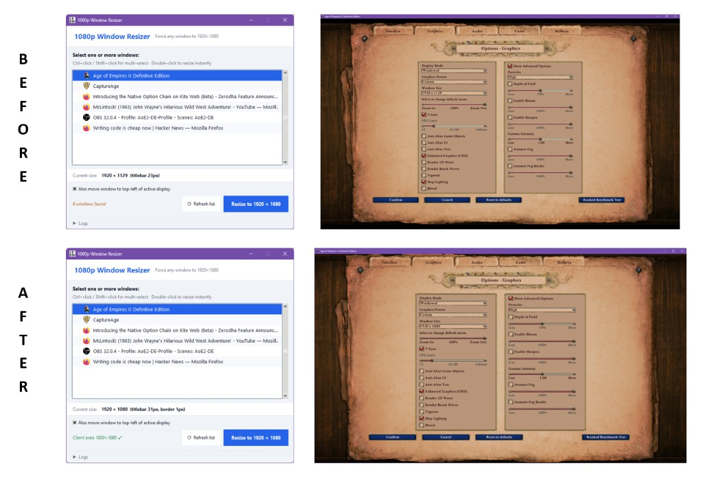

# 1080p Streaming Window

A Windows system-tray utility that forces any chosen window to exactly **1920 × 1080** pixels.  
Ensuring a clean, letterbox-free capture for Twitch / OBS window-capture sources.



---

## Features

- **System tray app** - lives quietly in the taskbar tray; no persistent terminal window
- **Window picker** - lists all visible, titled top-level windows with their icons
- **DWM-aware resizing** - accounts for title bars, window borders, and drop-shadows so the *client* (content) area is exactly 1920 × 1080, not just the outer frame; all coordinates are physical pixels regardless of display scaling
- **Collapsible debug log** - detailed resize diagnostics (outer rect, visible rect, shadow margins, NC frame, DPI) available on demand

---

## Requirements

| Requirement | Version |
|---|---|
| Windows | 10 or later |
| Python | 3.10+ |
| pywin32 | ≥ 310 |
| pystray | ≥ 0.19.5 |
| Pillow | ≥ 10.0.0 |

---

## Installation

```bash
git clone https://github.com/thecodeartist/1080p-streaming-window.git
cd 1080p-streaming-window

python -m venv pyvenv
pyvenv\Scripts\activate

pip install -r requirements.txt
```

---

## Running from source

```bash
python main.py
```

The app opens the window picker immediately and places an icon in the system tray.

**To resize a window:**
1. The picker lists all visible windows - scroll to find the one you want to capture in OBS
2. Click to select it (Ctrl+click / Shift+click for multiple windows)
3. The current client size is shown in the info bar below the list - green means already 1920×1080
4. Optionally check **Also move window to top-left of active display** to align it with your OBS scene
5. Click **Resize to 1920 × 1080** (or double-click a row for a single window)

Closing the picker exits the app.

To keep the app running, minimize the window instead of closing it.

While running, you can use the system tray icon to bring the window back to the front or to exit the application.

---

## Building a standalone executable

### Locally

Install PyInstaller once:

```bash
pip install pyinstaller
```

Then build:

```bash
pyinstaller --onefile --noconsole \
  --name "1080p-streaming-window" \
  --icon "1080p.ico" \
  --add-data "1080p.png;." \
  --hidden-import win32api \
  --hidden-import win32con \
  --hidden-import win32gui \
  --hidden-import win32ui \
  --hidden-import win32process \
  --hidden-import pystray._win32 \
  main.py
```

The output is `dist\1080p-streaming-window.exe` - no Python installation required to run it.

### Via GitHub Actions (CI)

Every push to the `main` branch triggers the **Build Windows Executable** workflow (`.github/workflows/build.yml`), which:

1. Spins up a `windows-latest` runner
2. Installs Python 3.12 and all dependencies
3. Runs PyInstaller with the same flags as the local build above
4. Uploads `1080p-streaming-window.exe` as a downloadable artifact (retained for 30 days)

Download the artifact from the **Actions** tab of the GitHub repository after a successful run.

---

## Project structure

```
1080p-streaming-window/
├── main.py                        # Application source
├── 1080p.png                      # Tray / window icon (runtime)
├── 1080p.ico                      # Executable icon (PyInstaller build)
├── Demo.png                       # Before/after screenshot
├── requirements.txt               # Runtime dependencies
├── .gitignore
└── .github/
    └── workflows/
        └── build.yml              # CI build workflow
```

---

## How the resize math works

Windows windows have three nested rectangles:

| Rectangle | Description |
|---|---|
| **Outer** (`GetWindowRect`) | Includes the invisible DWM drop-shadow |
| **Visible** (`DwmGetWindowAttribute`) | The rendered frame: title bar + borders |
| **Client** (`GetClientRect`) | The actual content area (what OBS captures) |

To get a 1920 × 1080 client area the tool computes:

```
outer_width  = 1920 + left_border + right_border + left_shadow + right_shadow
outer_height = 1080 + title_bar  + bottom_border + top_shadow + bottom_shadow
```

`SetWindowPos` is then called with those outer dimensions, landing the client area at exactly the target size.

---

## License

Apache License 2.0
